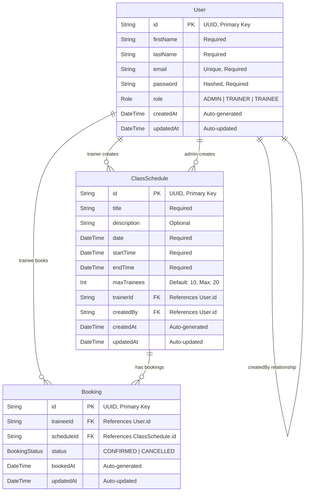

# Database Relational Diagram

## Gym Management System - Database Schema



## Detailed Relationship Description

### User Entity
- **Primary Key**: `id` (UUID)
- **Unique Constraints**: `email`
- **Roles**: ADMIN, TRAINER, TRAINEE
- **Relationships**: 
  - One User (TRAINER) can have many ClassSchedules (as trainer)
  - One User (ADMIN) can create many ClassSchedules (as creator)
  - One User (TRAINEE) can have many Bookings

### ClassSchedule Entity
- **Primary Key**: `id` (UUID)
- **Foreign Keys**: 
  - `trainerId` → References `User.id` (TRAINER role)
  - `createdBy` → References `User.id` (ADMIN role)
- **Business Rules**:
  - Maximum 5 schedules per day
  - Exactly 2-hour duration (endTime - startTime = 2 hours)
  - No trainer conflicts (same trainer, overlapping times)
  - maxTrainees between 1-20 (default: 10)

### Booking Entity
- **Primary Key**: `id` (UUID)
- **Foreign Keys**:
  - `traineeId` → References `User.id` (TRAINEE role)
  - `scheduleId` → References `ClassSchedule.id`
- **Unique Constraint**: (traineeId, scheduleId) for CONFIRMED status
- **Business Rules**:
  - Maximum maxTrainees bookings per schedule
  - Only future schedules can be booked
  - Cancellation allowed minimum 2 hours before start time

## Cardinality Details

### User to ClassSchedule (as Trainer)
- **Relationship**: One-to-Many
- **Description**: One trainer can be assigned to multiple class schedules
- **Constraint**: trainerId must reference a user with TRAINER role

### User to ClassSchedule (as Creator)
- **Relationship**: One-to-Many  
- **Description**: One admin can create multiple class schedules
- **Constraint**: createdBy must reference a user with ADMIN role

### User to Booking (as Trainee)
- **Relationship**: One-to-Many
- **Description**: One trainee can have multiple bookings
- **Constraint**: traineeId must reference a user with TRAINEE role

### ClassSchedule to Booking
- **Relationship**: One-to-Many
- **Description**: One class schedule can have multiple bookings
- **Constraint**: Cannot exceed maxTrainees confirmed bookings

## Database Indexes

```sql
-- Recommended indexes for performance optimization
CREATE INDEX idx_users_email ON User(email);
CREATE INDEX idx_users_role ON User(role);
CREATE INDEX idx_schedules_trainer ON ClassSchedule(trainerId);
CREATE INDEX idx_schedules_date ON ClassSchedule(date);
CREATE INDEX idx_schedules_start_time ON ClassSchedule(startTime);
CREATE INDEX idx_bookings_trainee ON Booking(traineeId);
CREATE INDEX idx_bookings_schedule ON Booking(scheduleId);
CREATE INDEX idx_bookings_status ON Booking(status);
CREATE INDEX idx_bookings_trainee_schedule ON Booking(traineeId, scheduleId);
```

## Business Logic Enforcement

### Database Level Constraints
- Primary keys ensure entity uniqueness
- Foreign keys maintain referential integrity  
- Unique constraints prevent duplicate emails
- NOT NULL constraints ensure required fields

### Application Level Business Rules
- Role-based access control (RBAC)
- Schedule duration validation (exactly 2 hours)
- Daily schedule limit (maximum 5 per day)
- Trainer conflict prevention
- Booking capacity management
- Cancellation time window enforcement
- Future-only booking validation

## Sample Data Flow

1. **Admin creates a Trainer**:
   ```
   User(ADMIN) → creates → User(TRAINER)
   ```

2. **Admin creates a Class Schedule**:
   ```
   User(ADMIN) → creates → ClassSchedule → assigns → User(TRAINER)
   ```

3. **Trainee books a Class**:
   ```
   User(TRAINEE) → creates → Booking → references → ClassSchedule
   ```

4. **System validates capacity**:
   ```
   COUNT(Booking WHERE scheduleId = X AND status = 'CONFIRMED') <= ClassSchedule.maxTrainees
   ```

This relational design ensures data integrity, enforces business rules, and provides efficient querying capabilities for the Gym Management System.
